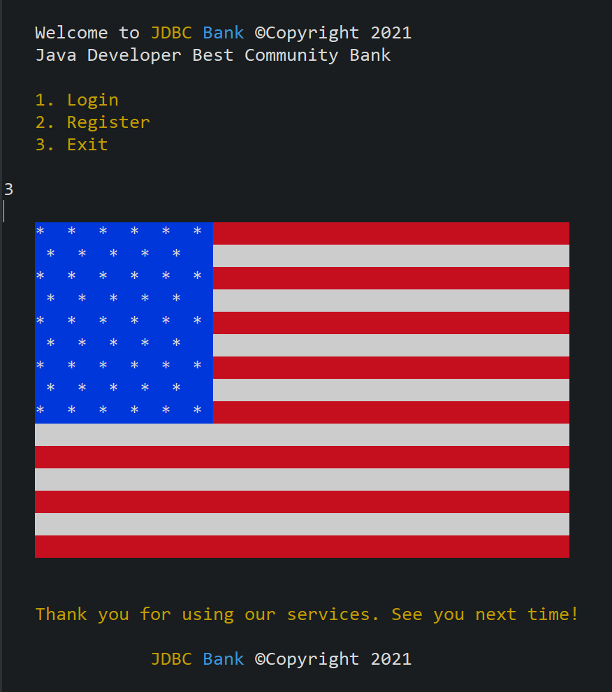
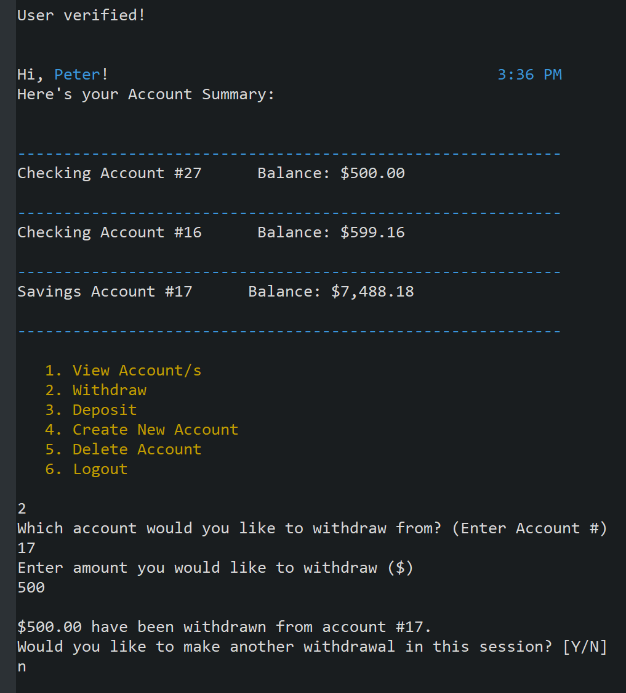

# 🤑 JDBC Bank :chart_with_upwards_trend:

## Description
__JDBC Bank__ is a console banking application built in Java. The app was designed for people who want to have quick access to their banking accounts on many different devices. JDBC Bank users can log in, open new checking or savings accounts, and make multiple withdrawals or deposits in a session!

## Table of Contents
* [Installation](#Installation)
* [Usage](#Usage)
* [Tech_Stack!](#Tech_Stack!)
* [License](#License)
* [Contributing](#Contributing)
* [Test](#Test)
* [Questions](#Questions)

## Installation

1. You can download the app from this github repository and run the JDBCBank.sql file to create tables in SQL.
2. Properties file contains necessary passwords to use the app.
3. After downloading the app, you can run it as Java application in Spring Tool Suite.

## Usage
To use the app you can login as an admin or as a user:
1. Admin: username - admin1, password - pass1
2. User: username - Peter123, password - 123

## Tech_Stack!
This app was created with the following programming languages, software, and technologies:
- Java
- Spring Tool Suite 4
- AWS RDS
- DBeaver
- JDBC
- Maven
- PostgreSQL
- Log4J
- JUnit

__Extra features that I implemented:__
1. Highly secure login
2. Unique usernames
3. Overdraft protection
4. Friendly UI
5. And more...

## License
This application is covered under the MIT license.

## Contributing
If you would like to work on this project with me, reach out using the contact info below.

## Test
JUnit tests were done on all user defined Java methods

## Questions
If you have additional questions, you can reach me via my GitHub profile: [peterdudek](https://github.com/peterdudek) 
or send me an email at: piotr72@gmail.com
